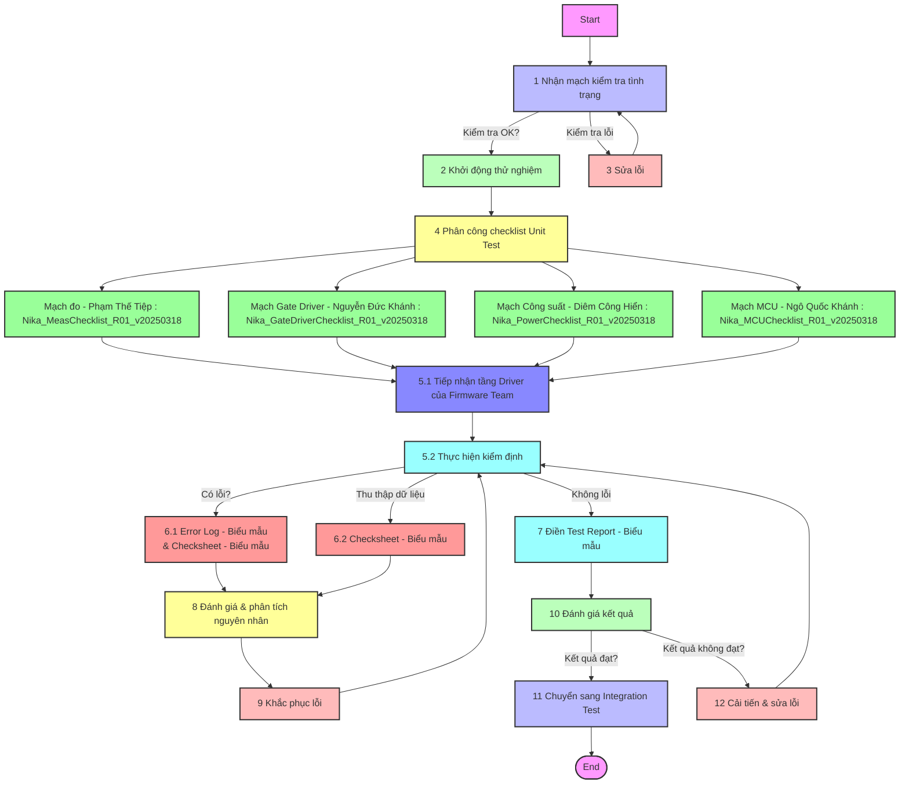
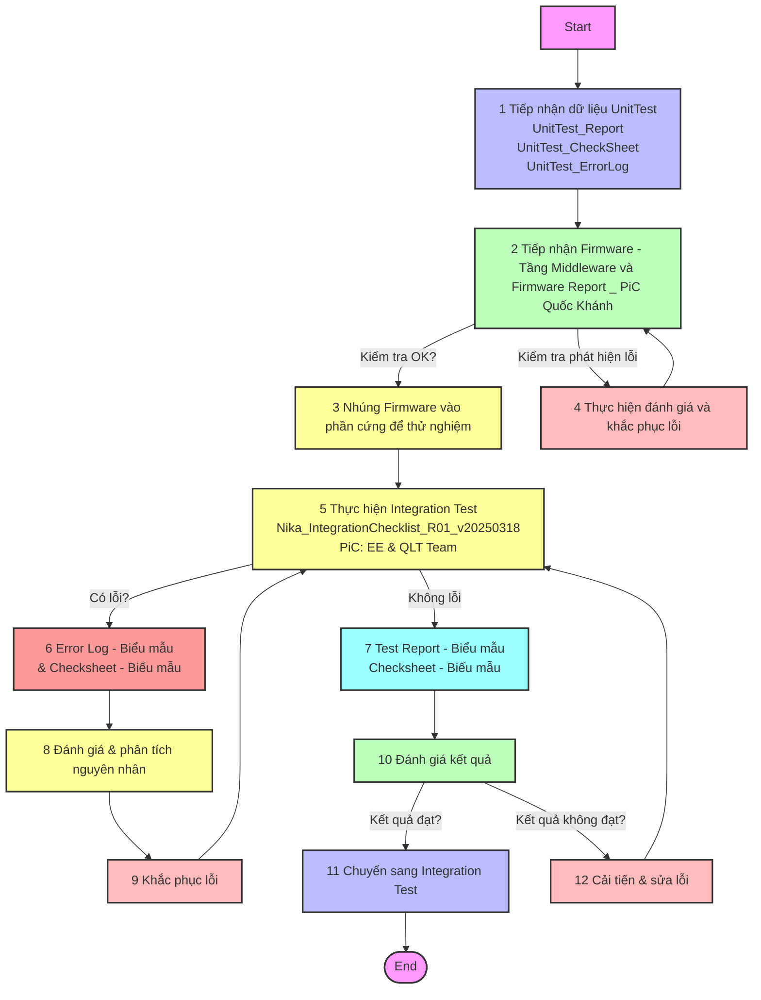
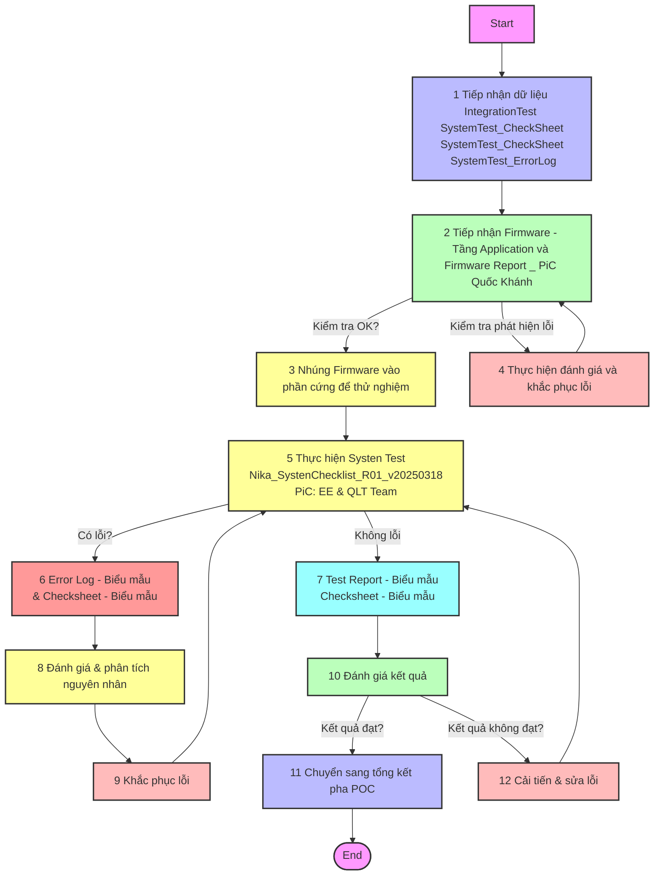

# DVP&R - Module AC/DC Charger 3.3kW (Giai đoạn POC)

**Mục tiêu:** Xác minh các chức năng cơ bản của Module AC/DC Charger 3.3kW trong giai đoạn POC, bao gồm Kiểm tra trước khi cấp nguồn, Kiểm tra phần mềm nhúng, Kiểm tra phần cứng (Hiệu suất tĩnh), và một số bài kiểm tra Hiệu suất động cơ bản.

## Thông Tin Dự Án và Văn Bản

| **Thông Tin Dự Án**         |                | **Thông Tin Văn Bản**         |                |
|-----------------------------|----------------|-------------------------------|----------------|
| Tên dự án                   | Nika           | Số văn bản                    | B201.POC.DVP&R.250325               |
| Người lập                   | Nguyễn Đức Khánh | Mã văn bản                    |                B201.POCC_DVP&R.v20250325|
| Ngày lập                    | 17/03/2025     | Phiên bản                     |        POC.DVP&R.0.1       |
| Người phê duyệt             | Nguyễn Duy Đỉnh | Ngày ban hành                 |           25/03/2025     |
| Ngày phê duyệt              |                |                               |                |

---

# Phạm vi kiểm định

Kiểm định giai đoạn POC với mục đích chính để xác nhận hoạt động của từng phần tử trong Moudle Nika 3.3kW

Đầu ra của bài kiểm định POC là nguyên mẫu có thể truyền tải 100% công suất SOR yêu cầu và hoạt động được khi không có sự vận hành đến từ bộ phận phát triển

Bài kiểm định được chia làm 3 giai đoạn:

1. Unit Test: Vận hành Unit Test là các kĩ sư phát triển phần cứng,lắm rõ về hệ thống để xác nhận hoạt động của từng phần tử nhỏ trong mạch
2. Integration Test: Vận hành chính là kĩ sư phát triển phần cứng và phần mềm nhằm xác nhận hoạt động của hệ thống khi có sự tác động của chương trình nhúng
3. System test: Vận hành chính là các kĩ sư/ TTS không trực tiếp phát triển (Nguyên mẫu đã đầy đủ chương trình để vận hành như trường hợp thực tế).

---

## I. Kế hoạch thực hiện kiểm tra POC

## I.1 Thiết bị sử dụng

## Danh sách thiết bị kiểm thử

| Thiết bị                     | Loại (Hiện có/Bổ sung) | Chức năng thiết bị                          |
|------------------------------|------------------------|---------------------------------------------|
| **CHROMA 62120D-1200**       | Hiện có                | Tải điện tử DC lập trình để mô phỏng tải, đo điện áp, dòng điện và công suất đầu ra. |
| **Chroma 61815**             | Hiện có                | Bộ giả lập lưới điện AC, cung cấp nguồn AC lập trình để kiểm tra điện áp, tần số và bảo vệ đầu vào. |
| **BK Precision 2709B**       | Hiện có                | Đồng hồ vạn năng, đo điện áp và dòng điện đầu vào/đầu ra. |
| **GW Instek GPM-8310**       | Hiện có                | Máy đo công suất, đo hiệu suất và hệ số công suất của module sạc. |
| **BK Precision MR50040**     | Hiện có                | Nguồn DC điện áp cao, cung cấp nguồn DC để kiểm tra điện áp và dòng điện đầu ra. |
| **Keysight DSOX1204G**       | Hiện có                | Máy hiện sóng, đo tín hiệu sóng như điện áp, dòng điện, gợn sóng và thời gian phản hồi. |
| **BK PRECISION CP62**        | Hiện có                | Đo dòng điện AC/DC với băng thông cao, kiểm tra dòng điện đầu vào/đầu ra. |
| **Siglent PP215**            | Bổ sung (Đang Load)    | Que đo cho máy hiện sóng, đo điện áp, dòng điện và gợn sóng với băng thông cao. |
| **BK Precision 8616**        | Hiện có                | Nguồn DC lập trình, cung cấp nguồn DC ổn định để kiểm tra các thông số đầu vào và đầu ra của module sạc. |
| **UNI-T UTP3303**            | Hiện có                 | Nguồn công suất thấp DC, cung cấp nguồn DC ổn định cho các bài kiểm tra công suất thấp hoặc mạch phụ trợ. |
| **PEM CWT (Probe đo dòng)**  | Hiện có                 | Probe đo dòng điện AC/DC không tiếp xúc, đo dòng điện với băng thông rộng, phù hợp kiểm tra gợn sóng và xung dòng. |
| **GW Instek APS-7100**       | Hiện có                 | Nguồn AC lập trình, cung cấp nguồn AC với điện áp và tần số điều chỉnh để kiểm tra đầu vào của module sạc. |
| **B&K Precision 2568**       | Hiện có                 | Máy hiện sóng kỹ thuật số, đo tín hiệu với băng thông 300 MHz, hỗ trợ phân tích chi tiết tín hiệu và ghi nhớ sóng dài. |

---

## I.2 Luồng thử nghiệm

---

## I.2.1 Unit test

**1. Mục đích của Unit Test là kiểm tra từng khối chính trong mạch, bao gồm mạch đo, mạch lái van, mạch công suất và mạch MCU.**

**2. Trong giai đoạn Unit Test, kỹ sư R&D đảm nhận vai trò kiểm định chính, với các bài kiểm định được thực hiện theo danh sách kiểm tra UnitTest_CheckList.**

**3. Trong giai đoạn này, không yêu cầu kỹ sư phần mềm có sẵn hệ thống Application Layer. Kỹ sư phần cứng sẽ tận dụng tối đa tầng Driver và các công cụ sẵn có để kiểm định phần cứng.**

---

## I.2.2 Integration test

**1. Mục đích của Integration Test là kiểm tra hoạt động của từng module chính (LLC, PFC, BUCK) khi nhúng chương trình tầng Middleware để vận hành. Từng module cần đảm bảo hoạt động ổn định và không xảy ra các lỗi nghiêm trọng trên phần cứng.**

**2. Trong giai đoạn Integration Test, kỹ sư R&D đảm nhận vai trò kiểm định chính, với các bài kiểm định được thực hiện theo danh sách kiểm tra IntegrationTest_CheckList.**

**3. Trong giai đoạn này, yêu cầu kỹ sư phần mềm hoàn thành tầng Middleware. Kỹ sư phần cứng sẽ tận dụng tối đa chương trình của kỹ sư phần mềm để thực hiện kiểm định.**

**4. Đầu ra của Intergation Test là các Module chính cần hoạt động ốn định và đảm bảo các trạng thái của hệ thống gồm: SoftStart, Power Transfer, Protection.**

---

## I.2.3 System Test

**1. Mục đích của System Test là kiểm tra hoạt động của toàn bộ hệ thống khi nhúng chương trình tầng Application để vận hành. Hệ thống cần đảm bảo hoạt động ổn định và không xảy ra các lỗi nghiêm trọng trên phần cứng.**

**2. Trong giai đoạn System Test, kỹ sư R&D cần rút bớt vai trò kiểm định. Tại pha System Tets, người không trực tiếp phát triển hệ thống cũng có thể vận hành hệ thống, với các bài kiểm định được thực hiện theo danh sách kiểm tra SystemTest_CheckList.**

**3. Trong giai đoạn này, yêu cầu kỹ sư phần mềm hoàn thành tầng Application. Kỹ sư phần cứng sẽ tận dụng tối đa chương trình của kỹ sư phần mềm để thực hiện kiểm định.**

**4. Đầu ra của System Test là hệ thống cần hoạt động ổn định và đảm bảo các trạng thái của hệ thống gần như hệ thống sạc thực tế: Cắm rút hệ thống, Bảo vệ lưới và Pin, và mức công suất truyển tải tối đa của hệ thống.**

---

## I.3 Thời gian thử nghiệm
## Kế Hoạch Phân Bổ Thời Gian Cho Giai Đoạn POC

| STT | Công Việc | Thời Gian Bắt Đầu | Thời Gian Kết Thúc | Người Đảm Nhận Chính |
|-----|----------|-------------------|-------------------|-------------------|
| 1 | Nhận mạch kiểm tra tình trạng | 28/03/2025 | 28/03/2025 | EE Team |
| 2 | Khởi động thử nghiệm | 28/03/2025 | 28/03/2025 | EE Team |
| 3 | Thực hiện Unit Test - Mạch đo | 28/03/2025 | 30/03/2025 | Phạm Thế Tiệp |
| 4 | Thực hiện Unit Test - Mạch Gate Driver | 28/03/2025 | 30/03/2025 | Nguyễn Đức Khánh |
| 5 | Thực hiện Unit Test - Mạch Công Suất | 28/03/2025 | 01/04/2025 | Diêm Công Hiển |
| 6 | Thực hiện Unit Test - Mạch MCU | 28/03/2025 | 01/04/2025 | Ngô Quốc Khánh |
| 7 | Đánh giá và khắc phục lỗi Unit Test | 28/03/2025 | 01/04/2025 | EE Team |
| 8 | Tiếp nhận dữ liệu Unit Test | 01/04/2025 | 01/04/2025 | EE & QLT Team |
| 9 | Tiếp nhận Firmware Middleware | 01/04/2025 | 01/04/2025 | Ngô Quốc Khánh |
| 10 | Thực hiện Integration Test | 01/04/2025 | 04/04/2025 | EE & QLT Team |
| 11 | Đánh giá và khắc phục lỗi Integration Test | 04/04/2025 | 06/04/2025 | EE & QLT Team |
| 12 | Tiếp nhận dữ liệu Integration Test | 06/04/2025 | 06/04/2025 | EE & QLT Team |
| 13 | Tiếp nhận Firmware Application | 06/04/2025 | 06/04/2025 | Ngô Quốc Khánh |
| 14 | Thực hiện System Test | 06/04/2025 | 08/04/2025 | EE & QLT Team && TTS |
| 15 | Đánh giá và khắc phục lỗi System Test | 08/04/2025 | 10/04/2025 | EE & QLT Team |
| 16 | Tổng kết pha POC | 10/04/2025 | 10/04/2025 | EE & QLT Team |

## Phân công RASCI
| Level | No.     | Tasks                                                                 | PiC        | Dr. Đỉnh | Đ.Khánh | Minh Tuấn | T. Tiếp | C.Hiển | Đình Đáng | Q.Khánh |
|-------|---------|----------------------------------------------------------------------|------------|----------|---------|-----------|---------|--------|-----------|---------|
| 1     | 1       | Xây dựng DFMEA                                                       | T. Tiếp    | SI       | SCI     |           | RA      | SC     | SC        |         |
| 1     | 2       | Xây dựng DVP&R (Design Verification Plan and Review)                 | Đ.Khánh    | SI       | RASCI   | SC        |         |        |           |         |
| 2     | 2.1     | Planning - Xác định phạm vi thực hiện                                | Đ.Khánh    | SI       | RASI    | SC        |         |        |           |         |
| 3     | 2.1.1   | Yêu cầu SOR (Confirm SOR)                                            | Dr. Đỉnh   | RASI     | SC      | SC        | SC      |        |           |         |
| 3     | 2.1.2   | Tài liệu đầu vào (SOR, Schematic, PCB Layout, BOM)                   | Đ.Khánh    | SI       | ASC     |           | RS      | RS     |           |         |
| 4     | 2.1.2.1 | SOR                                                                  | Dr. Đỉnh   | RASCI    |         |           |         |        |           |         |
| 4     | 2.1.2.2 | Yêu cầu tiêu chuẩn/ Checklist tiêu chuẩn cần tuân theo              | Đ.Khánh    | SI       | RAS     | SC        |         |        |           |         |
| 4     | 2.1.2.3 | Schematic, PCB Layout                                                | T. Tiếp    | SI       | SC      |           | RA      | RS     |           |         |
| 4     | 2.1.2.4 | BOM (E-BOM, M-BOM)                                                   | Đình Đáng  | SI       | SC      | SC        |         |        | RAI       |         |
| 4     | 2.1.2.5 | Test Plan (Checklist, Checksheet, test report, testERRORlog, Test Equipment.) | Đ.Khánh    | SCI      | RASC    |           |         |        |           |         |
| 2     | 2.2     | Kiểm Tra Thiết Kế (DVR - Design Verification Review)                 |            |          |         |           |         |        |           |         |
| 3     | 2.2.1   | Schematic Review                                                     | T. Tiếp    | I        | SC      |           | RAS     | R      |           |         |
| 3     | 2.2.2   | PCB Layout Review                                                    | T. Tiếp    | I        | SC      |           | RAS     | R      |           |         |
| 3     | 2.2.3   | BOM List review                                                      | Đình Đáng  | SCI      | RSI     |           |         |        | RAI       |         |
| 3     | 2.2.4   | Hợp nhất BOM để SMT                                                  | Đình Đáng  | I        | SCI     |           |         |        | RA        |         |
| 3     | 2.2.5   | Firmware review                                                      | Q.Khánh    | SCI      | SCI     |           | SCI     |        |           | RAI     |
| 3     | 2.2.6   | Thống nhất hồ sơ test                                                | Đ.Khánh    | SCI      | RASC    |           | SCI     |        |           |         |
| 2     | 2.3     | Thử Nghiệm Thiết Kế (Verification)                                   | Đ.Khánh    | SCI      | RASC    |           | SCI     |        |           |         |
| 3     | 2.3.1   | Phân loại module kiểm định                                           | Đ.Khánh    | SCI      | RASC    |           | SCI     |        |           |         |
| 3     | 2.3.2   | Unit Test (4 Unit theo Schematic có trước)                           |            |          |         |           |         |        |           |         |
| 4     | 2.3.2.1 | Unit Test - Measurement                                              | T. Tiếp    | SI       | CI      |           | RAI     | SC     |           |         |
| 4     | 2.3.2.2 | Unit Test - Gate driver                                              | Đ.Khánh    | SI       | RAI     |           | SCI     |        |           |         |
| 4     | 2.3.2.3 | Unit Test - Power circuit                                            | C.Hiển     | SI       | CI      |           | SCI     | RAI    |           |         |
| 4     | 2.3.2.4 | Unit Test - MCU                                                      | Q.Khánh    | SI       | CI      |           | SCI     |        |           | RAI     |
| 4     | 2.3.2.5 | Thu thập và phân tích dữ liệu cho UnitTest                           | Đ.Khánh    | SI       | RA      |           | RI      | RI     |           | RI      |
| 3     | 2.3.3   | Integration Test (Test Timeline, test checklist, PiC, tiêu chí chấp nhận…) | Q.Khánh    | SI       | SC      |           | SCI     | SC     |           | RAI     |
| 4     | 2.3.3.1 | Hoàn thiện firmware phục vụ test (Điều khiển, protection, CPSS)      | Q.Khánh    | SI       | SC      |           | SCI     | SC     |           | RAI     |
| 4     | 2.3.3.2 | Thực hiện nhúng firmware và debug module (PFC, LLC, BUCK)            | C.Hiển     | SI       | RC      |           | RC      | RA     |           | SCI     |
| 4     | 2.3.3.3 | Thực hiện bài test Integration                                       | C.Hiển     | SI       | RC      |           | RC      | RA     |           | RC      |
| 4     | 2.3.3.4 | Thu thập và phân tích dữ liệu cho IntegrationTest                    | Đ.Khánh    | SI       | RA      |           | RC      | RC     |           | RC      |
| 3     | 2.3.4   | System test (Test Timeline, test checklist, PiC, tiêu chí chấp nhận…) |            |          |         |           |         |        |           |         |
| 4     | 2.3.4.1 | Hoàn thiện firmware phục vụ test hệ thống (Khởi động, Hồ sơ sạc, Protection) hợp bộ (3 stage) - Mục tiêu Chỉ thực hiện căng rút hệ thống để đánh giá chất lượng | Q.Khánh    | SI       | SC      |           | SCI     | SC     |           | RAI     |
| 4     | 2.3.4.2 | Thực hiện bài test System                                            | C.Hiển     | SI       | RC      |           | RC      | RA     |           | RC      |
| 4     | 2.3.4.3 | Thu thập và phân tích dữ liệu cho SystemTest                         | Đ.Khánh    | SI       | RA      |           | RC      | RC     |           | RC      |
| 3     | 2.3.5   | Thiết kế bài test     (Thực hiện cho System Test)                                               |     Đ.Khánh       |   SI        |     RA    |      CI     |    CI     |        |     CI      |    CI     |
| 3     | 2.3.6   | Hướng dẫn thực hiện bài test    (Thực hiện cho System Test)                                     |    Đ.Khánh        |    SI       |     RA    |           |      CI   |   CI     |    CI       |   CI      |
| 3     | 2.3.7   | Thực hiện kiểm thử (Test Execution)                                 |     Đ.Khánh       |   SI        |     RA    |      CI     |    CI     |   CI      |     CI      |    CI     |
| 3     | 2.3.8   | Kết quả kiểm thử (Verification Results)                              |     Đ.Khánh       |   SI        |     RA    |      CI     |    CI     |   CI      |     CI      |    CI     |
| 2     | 2.4     | Kết luận và Khuyến nghị (Conclusion and Recommendations)             |     Đ.Khánh       |   SI        |     RA    |      CI     |    CI     |   CI      |     CI      |    CI     |
| 3     | 2.4.1   | Test Report, Test ErrorLog, Make decision                            |     Đ.Khánh       |   SI        |     RA    |      CI     |    CI     |   CI      |     CI      |    CI     |
**Ghi chú:**
- EE Team: Nhóm kỹ sư phần cứng.
- QLT Team: Nhóm quản lý chất lượng.
- Thời gian có thể điều chỉnh tùy theo tiến độ thực tế.

---

## II. Chi tiết thực hiện

## II.1 Unit test

## II.1.1 Measurement Circuit Test

## Danh sách tài liệu tham chiếu: 

- Bảng kiểm tra (POC_Meas-CHKSHEET-[Mã bài test]), 
- Nhật ký lỗi (POC-ERROR-[Mã bài test]), 
- Báo cáo thử nghiệm (POC_Meas-REPORT-2025-03-18).

## Danh sách bài kiểm định

| Mã bài kiểm định | Mức ưu tiên | Bài kiểm định                                      | Tiêu chí chấp nhận                                                                 | Kết quả (✔/✘/N/A) | Ghi chú                                      |
|------------------|-------------|----------------------------------------------------|------------------------------------------------------------------------------------|-------------------|----------------------------------------------|
| POC_Meas-001     | Cao         | Supply. Kiểm tra nguồn 5V cho TLV9001              | Điện áp 5V ±1% ổn định                                                            |                   | [Tham chiếu POC-ERROR-POC_Meas-001 nếu ✘]   |
| POC_Meas-002     | Cao         | Supply. Kiểm tra nguồn 5V cho AMC1300DWVR          | Điện áp 5V ±1% ổn định                                                            |                   | [Tham chiếu POC-ERROR-POC_Meas-002 nếu ✘]   |
| POC_Meas-003     | Cao         | Supply. Kiểm tra nguồn 3.3V cho INA181             | Điện áp 3.3V ±1% ổn định                                                          |                   | [Tham chiếu POC-ERROR-POC_Meas-003 nếu ✘]   |
| POC_Meas-004     | Cao         | Supply. Kiểm tra điện áp REF của INA181 2.5V       | Điện áp 2.5V ±1% ổn định                                                          |                   | [Tham chiếu POC-ERROR-POC_Meas-004 nếu ✘]   |
| POC_Meas-005     | Cao         | Supply. Kiểm tra điện áp REF của TLV9001 2.5V      | Điện áp 2.5V ±1% ổn định                                                          |                   | [Tham chiếu POC-ERROR-POC_Meas-005 nếu ✘]   |
| POC_Meas-006     | Cao         | Supply. Kiểm tra nguồn 5V cho TMCS1131             | Điện áp 5V ±1% ổn định                                                            |                   | [Tham chiếu POC-ERROR-POC_Meas-006 nếu ✘]   |
| POC_Meas-007     | Cao         | Value. Kiểm tra giá trị đo đầu ra TLV9001 (AC voltage check) | Đo tại các điểm 50Vrms, 180Vrms, 230Vrms, 265Vrms - Tín hiệu đo đúng với tính toán (Tham chiếu POC_Meas-007) |                   | [Tham chiếu POC-ERROR-POC_Meas-007 nếu ✘]   |
| POC_Meas-008     | Cao         | Value. Kiểm tra giá trị đo đầu ra TMCS1131 (AC current check) | Đo tại các điểm 50Vrms, 180Vrms, 230Vrms, 265Vrms - Tín hiệu đo đúng với tính toán (Tham chiếu POC_Meas-008) |                   | [Tham chiếu POC-ERROR-POC_Meas-008 nếu ✘]   |
| POC_Meas-009     | Cao         | Value. Kiểm tra giá trị đo đầu ra INA181 (DC Current check) | Đo tại các điểm 0.5A, 1A, 5A, 10A, 15A - Tín hiệu đo đúng với tính toán (Tham chiếu POC_Meas-009) |                   | [Tham chiếu POC-ERROR-POC_Meas-009 nếu ✘]   |
| POC_Meas-010     | Cao         | Value. Kiểm tra giá trị đo AMC1300+TLV9001 (DC voltage Check) | Đo tại các điểm 100V, 200V, 300V, 500V - Tín hiệu đo đúng với tính toán (Tham chiếu POC_Meas-010) |                   | [Tham chiếu POC-ERROR-POC_Meas-010 nếu ✘]   |
| POC_Meas-011     | Cao         | Value. Kiểm tra giá trị đo AMC1300+TLV9001 (Battery voltage Check) | Đo tại các điểm 100V, 200V, 300V, 500V - Tín hiệu đo đúng với tính toán (Tham chiếu POC_Meas-011) |                   | [Tham chiếu POC-ERROR-POC_Meas-011 nếu ✘]   |
| POC_Meas-012     | Cao         | Protect. Kiểm tra bảo vệ OVP AC                    | Biên độ bảo vệ đúng thiết kế, thời gian bảo vệ đúng thiết kế - tính toán (Tham chiếu POC_Meas-012) |                   | [Tham chiếu POC-ERROR-POC_Meas-012 nếu ✘]   |
| POC_Meas-013     | Cao         | Protect. Kiểm tra bảo vệ UVP AC                    | Biên độ bảo vệ đúng thiết kế, thời gian bảo vệ đúng thiết kế - tính toán (Tham chiếu POC_Meas-013) |                   | [Tham chiếu POC-ERROR-POC_Meas-013 nếu ✘]   |
| POC_Meas-014     | Cao         | Protect. Kiểm tra bảo vệ OCP AC                    | Biên độ bảo vệ đúng thiết kế, thời gian bảo vệ đúng thiết kế - tính toán (Tham chiếu POC_Meas-014) |                   | [Tham chiếu POC-ERROR-POC_Meas-014 nếu ✘]   |
| POC_Meas-015     | Cao         | Protect. Kiểm tra bảo vệ OCP DC current            | Biên độ bảo vệ đúng thiết kế, thời gian bảo vệ đúng thiết kế - tính toán (Tham chiếu POC_Meas-015) |                   | [Tham chiếu POC-ERROR-POC_Meas-015 nếu ✘]   |
| POC_Meas-016     | Cao         | Protect. Kiểm tra bảo vệ OVP DC output             | Biên độ bảo vệ đúng thiết kế, thời gian bảo vệ đúng thiết kế - tính toán (Tham chiếu POC_Meas-016) |                   | [Tham chiếu POC-ERROR-POC_Meas-016 nếu ✘]   |

---

## II.1.2 Gate Driver Circuit Test

## Danh sách tài liệu tham chiếu: 

- Bảng kiểm tra (POC_GateDriver-CHKSHEET-[Mã bài test]), 
- Nhật ký lỗi (POC_ERROR-[Mã bài test]), 
- Báo cáo thử nghiệm (POC_GateDriver-REPORT-2025-03-18).

## Danh sách bài kiểm định (Gate Driver)

| Mã bài kiểm định    | Mức ưu tiên | Bài kiểm định                                      | Tiêu chí chấp nhận                                                                 | Kết quả (✔/✘/N/A) | Ghi chú                                      |
|---------------------|-------------|----------------------------------------------------|------------------------------------------------------------------------------------|-------------------|----------------------------------------------|
| POC_GateDriver-001  | Cao         | Tín hiệu đầu vào UCC23313                          | Biên độ tín hiệu 3.3V ±1%, tần số đúng bằng tần số phát. Rise time, Fall time tham chiếu datasheet (Tham chiếu POC_GateDriver-001) |                   | [Tham chiếu POC-ERROR-POC_GateDriver-001 nếu ✘] |
| POC_GateDriver-003  | Cao         | Kiểm tra nguồn cấp 12V cho UCC23313                | Điện áp ổn định tại 12V ±1%                                                        |                   | [Tham chiếu POC-ERROR-POC_GateDriver-003 nếu ✘] |
| POC_GateDriver-004  | Cao         | Kiểm tra điện áp BoostTrap_PFC 12V cho UCC23313    | Điện áp ổn định tại 12V ±1%                                                        |                   | [Tham chiếu POC-ERROR-POC_GateDriver-004 nếu ✘] |
| POC_GateDriver-005  | Cao         | Kiểm tra nguồn cấp 23V cho UCC23313                | Điện áp ổn định tại 23V ±1%                                                        |                   | [Tham chiếu POC-ERROR-POC_GateDriver-005 nếu ✘] |
| POC_GateDriver-006  | Cao         | Kiểm tra điện áp BoostTrap_PFC 23V cho UCC23313    | Điện áp ổn định tại 23V ±1%                                                        |                   | [Tham chiếu POC-ERROR-POC_GateDriver-006 nếu ✘] |
| POC_GateDriver-007  | Cao         | Kiểm tra tín hiệu đầu ra UCC23313 PFC              | Biên độ tín hiệu 12V ±1%, tần số đúng bằng tần số phát. Rise time, Fall time tham chiếu datasheet (Tham chiếu POC_GateDriver-007) |                   | [Tham chiếu POC-ERROR-POC_GateDriver-007 nếu ✘] |
| POC_GateDriver-008  | Cao         | Kiểm tra tín hiệu đầu ra UCC23313 Buck             | Biên độ tín hiệu 23V ±1%, tần số đúng bằng tần số phát. Rise time, Fall time tham chiếu datasheet (Tham chiếu POC_GateDriver-008) |                   | [Tham chiếu POC-ERROR-POC_GateDriver-008 nếu ✘] |
| POC_GateDriver-009  | Cao         | Tín hiệu lái SiC mạch Buck, sau trở gate           | Biên độ tín hiệu -3V - 20V ±1%, tần số đúng bằng tần số phát. Rise time, Fall time tham chiếu datasheet (Tham chiếu POC_GateDriver-009) |                   | [Tham chiếu POC-ERROR-POC_GateDriver-009 nếu ✘] |
| POC_GateDriver-010  | Cao         | Kiểm tra tín hiệu vào module GaN                   | Biên độ tín hiệu 3.3V ±1%, tần số đúng bằng tần số phát. Rise time, Fall time tham chiếu datasheet (Tham chiếu POC_GateDriver-010) |                   | [Tham chiếu POC-ERROR-POC_GateDriver-010 nếu ✘] |
| POC_GateDriver-011  | Cao         | Kiểm tra nguồn 12V GaN Module                      | Điện áp ổn định tại 12V ±1%                                                        |                   | [Tham chiếu POC-ERROR-POC_GateDriver-011 nếu ✘] |
| POC_GateDriver-012  | Cao         | Kiểm tra tín hiệu GaN Internal LDO 5V              | Điện áp ổn định tại 5V ±1%                                                         |                   | [Tham chiếu POC-ERROR-POC_GateDriver-012 nếu ✘] |
| POC_GateDriver-013  | Cao         | Kiểm tra tín hiệu VNEG -14V trên Module GaN        | Điện áp ổn định tại -14V ±1%                                                       |                   | [Tham chiếu POC-ERROR-POC_GateDriver-013 nếu ✘] |
| POC_GateDriver-014  | Cao         | Kiểm tra tín hiệu đầu ra Isolator                  | Biên độ tín hiệu 5V ±1%, tần số đúng bằng tần số phát. Rise time, Fall time tham chiếu datasheet (Tham chiếu POC_GateDriver-014) |                   | [Tham chiếu POC-ERROR-POC_GateDriver-014 nếu ✘] |

---

## II.1.3. Power Circuit Test

## Danh sách tài liệu tham chiếu: 

- Bảng kiểm tra (POC_Power-CHKSHEET-[Mã bài test]), 
- Nhật ký lỗi (POC-ERROR-[Mã bài test]), 
- Báo cáo thử nghiệm (POC_Power-REPORT-2025-03-18).

## Danh sách bài kiểm định

| Mã bài kiểm định | Mức ưu tiên | Bài kiểm định                                      | Tiêu chí chấp nhận                                                                 | Kết quả (✔/✘/N/A) | Ghi chú                                      |
|------------------|-------------|----------------------------------------------------|------------------------------------------------------------------------------------|-------------------|----------------------------------------------|
| POC_Power-001    | Cao         | Component. Điện cảm mạch PFC                       | Điện cảm đúng giá trị - Điện trở 1 chiều và xoay chiều đúng giá trị < 5%          |                   | [Tham chiếu POC-ERROR-POC_Power-001 nếu ✘] |
| POC_Power-002    | Cao         | Component. Biến áp mạch LLC                        | 1. Điện cảm đúng giá trị - Điện trở 1 chiều và xoay chiều - Tụ điện ký sinh đúng giá trị < 5% 2. Cách điện >1kV |                   | [Tham chiếu POC-ERROR-POC_Power-002 nếu ✘] |
| POC_Power-003    | Cao         | Component. Điện cảm mạch Buck                      | Điện cảm đúng giá trị - Điện trở 1 chiều và xoay chiều - đúng giá trị < 5%        |                   | [Tham chiếu POC-ERROR-POC_Power-003 nếu ✘] |
| POC_Power-004    | Cao         | Power. DPT nhánh van HighSpeed PFC                 | Tại dòng chuyển mạch lớn nhất, điện áp lớn nhất, điều kiện hoạt động của van không vượt quá ngưỡng kỳ vọng (Tham chiếu POC_Power-004) |                   | [Tham chiếu POC-ERROR-POC_Power-004 nếu ✘] |
| POC_Power-005    | Cao         | Power. DPT Mạch GAN tầng LLC                       | Tại dòng chuyển mạch lớn nhất, điện áp lớn nhất, điều kiện hoạt động của van không vượt quá ngưỡng kỳ vọng (Tham chiếu POC_Power-005) |                   | [Tham chiếu POC-ERROR-POC_Power-005 nếu ✘] |
| POC_Power-006    | Cao         | Power. DPT SiC HB của mạch Buck                    | Tại dòng chuyển mạch lớn nhất, điện áp lớn nhất, điều kiện hoạt động của van không vượt quá ngưỡng kỳ vọng (Tham chiếu POC_Power-006) |                   | [Tham chiếu POC-ERROR-POC_Power-006 nếu ✘] |
| POC_Power-007    | Cao         | Power. Kiểm chứng khả năng hoạt động PFC           | Bộ biến đổi hoạt động vòng hở được tại ngưỡng điện áp tối đa trong thử nghiệm thời gian ngắn (Tham chiếu POC_Power-007) |                   | [Tham chiếu POC-ERROR-POC_Power-007 nếu ✘] |
| POC_Power-008    | Cao         | Power. Kiểm chứng khả năng hoạt động của van bán dẫn và điện cảm PFC | Tại công suất định mức (hoặc 85% định mức), điều kiện tản nhiệt giống thực tế - Độ tăng nhiệt của van bán dẫn, điện cảm PFC và hoạt động của PFC không có sự cố sau 10 phút thử nghiệm (Tham chiếu POC_Power-008) |                   | [Tham chiếu POC-ERROR-POC_Power-008 nếu ✘] |
| POC_Power-009    | Trung Bình - Có thể truyền qua Integration test | Power. Kiểm chứng khả năng hoạt động vòng kín của PFC | Hệ số PF > 0.99, THDi < 5%, Hoạt động ổn định trên toàn dải tải (10%-100%) (Tham chiếu POC_Power-009) |                   | [Tham chiếu POC-ERROR-POC_Power-009 nếu ✘] |
| POC_Power-010    | Trung Bình - Có thể truyền qua Integration test | Power. Kiểm tra căng lưới PFC                      | Hệ số PF > 0.99, THDi < 5%, Hoạt động ổn định trên toàn dải tải (10%-100%) (Tham chiếu POC_Power-010) |                   | [Tham chiếu POC-ERROR-POC_Power-010 nếu ✘] |
| POC_Power-011    | Cao         | Power. Kiểm chứng khả năng hoạt động LLC - Điều kiện thấp áp | Tại tần số cố định (750kHz), độ khuếch đại điện áp (Ra/Vào ~ 1) (Tham chiếu POC_Power-011) |                   | [Tham chiếu POC-ERROR-POC_Power-011 nếu ✘] |
| POC_Power-012    | Cao         | Power. Kiểm chứng công suất mạch LLC - Kiểm chứng chuyển mạch mềm | Tại tần số cố định (750kHz), deadtime cố định, mạch van đạt chuyển mạch mềm ZVS (Tham chiếu POC_Power-012) |                   | [Tham chiếu POC-ERROR-POC_Power-012 nếu ✘] |
| POC_Power-013    | Cao         | Power. Kiểm chứng khả năng truyền tải công suất    | Điện áp ra, dòng điện đầu ra ổn định tại công suất định mức (550V - 6A), độ tăng nhiệt theo kỳ vọng, hiệu suất bộ biến đổi theo kỳ vọng (Tham chiếu POC_Power-013) |                   | [Tham chiếu POC-ERROR-POC_Power-013 nếu ✘] |
| POC_Power-014    | Cao         | Power. Kiểm chứng khả năng hoạt động Buck - Điều kiện thấp áp | Tại tần số cố định (250kHz) cố định, duty không đổi (25%, 50%, 75%, 80%) độ khuếch đại điện áp (Ra/Vào) như kỳ vọng (Tham chiếu POC_Power-014) |                   | [Tham chiếu POC-ERROR-POC_Power-014 nếu ✘] |
| POC_Power-015    | Cao         | Power. Kiểm chứng khả năng truyền tải công suất    | Điện áp ra, dòng điện đầu ra ổn định tại công suất định mức (3.3kW (500V6.6A - 200V15A..), độ tăng nhiệt theo kỳ vọng, hiệu suất bộ biến đổi theo kỳ vọng (Tham chiếu POC_Power-015) |                   | [Tham chiếu POC-ERROR-POC_Power-015 nếu ✘] |
| POC_Power-016    | Trung Bình - Có thể truyền qua Integration test | Power. Kiểm chứng khả năng hoạt động vòng kín của Buck theo điểm tải | Tại điều kiện điện áp cố định, thay đổi tải đầu ra, điện áp bám giá trị đặt (Tham chiếu POC_Power-016) |                   | [Tham chiếu POC-ERROR-POC_Power-016 nếu ✘] |
| POC_Power-017    | Trung Bình - Có thể truyền qua Integration test | Power. Kiểm tra khả năng sạc Charging Profile      | Tại điện áp vào 550V, bộ Buck hoàn thành dải sạc (CP,CC,CV) (Tham chiếu POC_Power-017) |                   | [Tham chiếu POC-ERROR-POC_Power-017 nếu ✘] |

---

## II.1.4 MCU Circuit Test

## Danh sách tài liệu tham chiếu: 

- Bảng kiểm tra (POC_MCU-CHKSHEET-[Mã bài test]), 
- Nhật ký lỗi (POC-ERROR-[Mã bài test]), 
- Báo cáo thử nghiệm (POC_MCU-REPORT-2025-03-18).

## Danh sách bài kiểm định

| Mã bài kiểm định | Mức ưu tiên | Bài kiểm định                                      | Tiêu chí chấp nhận                                                                 | Kết quả (✔/✘/N/A) | Ghi chú                                      |
|------------------|-------------|----------------------------------------------------|------------------------------------------------------------------------------------|-------------------|----------------------------------------------|
| POC_MCU-001      | Cao         | Kiểm chứng nguồn ISO 5V                            | Đúng giá trị điện áp, sai số <1% (Tham chiếu Reference - POC_MCU-001)             |                   | [Tham chiếu POC-ERROR-POC_MCU-001 nếu ✘]    |
| POC_MCU-002      | Cao         | Kiểm chứng nguồn ISO 3.3V, mcu_VDDA/IO             | Đúng giá trị điện áp, sai số <1% (Tham chiếu Reference - POC_MCU-002)             |                   | [Tham chiếu POC-ERROR-POC_MCU-002 nếu ✘]    |
| POC_MCU-003      | Cao         | Kiểm chứng nguồn Ext 5V                            | Đúng giá trị điện áp, sai số <1% (Tham chiếu Reference - POC_MCU-003)             |                   | [Tham chiếu POC-ERROR-POC_MCU-003 nếu ✘]    |
| POC_MCU-004      | Cao         | Kiểm chứng PWM PFC, từ chân MCU                    | Tần số ổn định, deadtime ổn định, biên độ và dạng sóng không biến dạng (Sai số <1%) (Tham chiếu Reference - POC_MCU-004) |                   | [Tham chiếu POC-ERROR-POC_MCU-004 nếu ✘]    |
| POC_MCU-005      | Cao         | Kiểm chứng PWM LLC, từ chân MCU                    | Tần số ổn định, deadtime ổn định, biên độ và dạng sóng không biến dạng (Sai số <1%) (Tham chiếu Reference - POC_MCU-005) |                   | [Tham chiếu POC-ERROR-POC_MCU-005 nếu ✘]    |
| POC_MCU-006      | Cao         | Kiểm chứng PWM Buck, từ chân MCU                   | Tần số ổn định, deadtime ổn định, biên độ và dạng sóng không biến dạng (Sai số <1%) (Tham chiếu Reference - POC_MCU-006) |                   | [Tham chiếu POC-ERROR-POC_MCU-006 nếu ✘]    |
| POC_MCU-007      | Cao         | Kiểm chứng GPIO FAN, từ chân MCU                   | Bảo vệ đúng giá trị dòng điện, sai số <1% (Tham chiếu Reference - POC_MCU-007)    |                   | [Tham chiếu POC-ERROR-POC_MCU-007 nếu ✘]    |
| POC_MCU-008      | Cao         | Kiểm chứng GPIO Relay, từ chân MCU                 | Tham chiếu Reference - POC_MCU-008                                                |                   | [Tham chiếu POC-ERROR-POC_MCU-008 nếu ✘]    |
| POC_MCU-009      | Cao         | Kiểm chứng tín hiệu đo về chân CMPSS tại chân MCU  | Đúng giá trị điện áp, sai số <1% (Tham chiếu Reference - POC_MCU-009)             |                   | [Tham chiếu POC-ERROR-POC_MCU-009 nếu ✘]    |
| POC_MCU-010      | Cao         | Kiểm chứng giá trị gửi về mạch đo dòng điện đầu vào Iac | Sai số trả về MCU <2% (Tham chiếu Reference - POC_MCU-010)                        |                   | [Tham chiếu POC-ERROR-POC_MCU-010 nếu ✘]    |
| POC_MCU-011      | Cao         | Kiểm chứng giá trị gửi về mạch đo dòng điện đầu vào Vac | Sai số trả về MCU <2% (Tham chiếu Reference - POC_MCU-011)                        |                   | [Tham chiếu POC-ERROR-POC_MCU-011 nếu ✘]    |
| POC_MCU-012      | Cao         | Kiểm chứng giá trị gửi về mạch đo dòng điện đầu vào Vdc | Sai số trả về MCU <2% (Tham chiếu Reference - POC_MCU-012)                        |                   | [Tham chiếu POC-ERROR-POC_MCU-012 nếu ✘]    |
| POC_MCU-013      | Cao         | Kiểm chứng giá trị gửi về mạch đo dòng điện đầu vào Idc | Sai số trả về MCU <2% (Tham chiếu Reference - POC_MCU-013)                        |                   | [Tham chiếu POC-ERROR-POC_MCU-013 nếu ✘]    |
| POC_MCU-014      | Cao         | Kiểm chứng thời gian bảo vệ CMPSS | Thời gian bảo vệ đúng với thiết kế (...ns) (Tham chiếu Reference - POC_MCU-014)                        |                   | [Tham chiếu POC-ERROR-POC_MCU-014 nếu ✘]    |

---

## II.2 Integration test

## Danh sách tài liệu tham chiếu: 

- Bảng kiểm tra (POC_Integration-CHKSHEET-[Mã bài test]), 
- Nhật ký lỗi (POC-ERROR-[Mã bài test]), 
- Báo cáo thử nghiệm (POC_Integration-REPORT-2025-03-18).

## Danh sách bài kiểm định (Integration)

| Mã bài kiểm định    | Mức ưu tiên | Bài kiểm định                                      | Tiêu chí chấp nhận                                                                 | Kết quả (✔/✘/N/A) | Ghi chú                                      |
|---------------------|-------------|----------------------------------------------------|------------------------------------------------------------------------------------|-------------------|----------------------------------------------|
| POC_Integration-001 | Cao         | Integration. Kiểm chứng khả năng hoạt động vòng kín của PFC | Hệ số PF > 0.99, THDi < 5%, Hoạt động ổn định trên toàn dải tải (10%-100%) (Tham chiếu POC_Integration-001) |                   | [Tham chiếu POC-ERROR-POC_Integration-001 nếu ✘] |
| POC_Integration-002 | Cao         | Integration. Kiểm tra căng lưới PFC                | Hệ số PF > 0.99, THDi < 5%, Hoạt động ổn định trên toàn dải tải (10%-100%) (Tham chiếu POC_Integration-002) |                   | [Tham chiếu POC-ERROR-POC_Integration-002 nếu ✘] |
| POC_Integration-003 | Cao         | Integration. Kiểm chứng khả năng hoạt động vòng kín của Buck theo điểm tải | Tại điều kiện điện áp cố định, thay đổi tải đầu ra, điện áp bám giá trị đặt (Tham chiếu POC_Integration-003) |                   | [Tham chiếu POC-ERROR-POC_Integration-003 nếu ✘] |
| POC_Integration-004 | Cao         | Integration. Kiểm tra khả năng sạc Charging Profile của Buck | Tại điện áp vào 550V, bộ Buck hoàn thành dải sạc (CP,CC,CV) (Tham chiếu POC_Integration-004) |                   | [Tham chiếu POC-ERROR-POC_Integration-004 nếu ✘] |
| POC_Integration-005 | Cao         | Integration. Hợp bộ tầng PFC và LLC                | Hai tầng hoạt động ổn định (Điện áp ra LLC 550V - Dòng 0 -> 6A) Tầng PFC ổn định (PF > 0.99, THDi < 5%) Thời gian chạy ổn định >=10p (Tham chiếu POC_Integration-005) |                   | [Tham chiếu POC-ERROR-POC_Integration-005 nếu ✘] |
| POC_Integration-006 | Cao         | Integration. Hợp bộ tầng LLC và Buck               | Hai tầng hoạt động ổn định (Điện áp ra LLC 550V - Dòng 0 -> 6A) Tầng Buck hoạt động ổn định tại công suất định mức 3.3kW (Tham chiếu POC_Integration-006) |                   | [Tham chiếu POC-ERROR-POC_Integration-006 nếu ✘] |
| POC_Integration-007 | Cao         | Integration. Hợp bộ ba tầng PFC, LLC và Buck (One Point - Maximum Power) | Hai tầng hoạt động ổn định (Điện áp ra LLC 550V - Dòng 0 -> 6A) Tầng Buck hoạt động ổn định tại công suất định mức 3.3kW (Tham chiếu POC_Integration-007) |                   | [Tham chiếu POC-ERROR-POC_Integration-007 nếu ✘] |
| POC_Integration-008 | Cao         | Integration. Hợp bộ ba tầng PFC, LLC và Buck với bộ điều khiển Charging Profile | Hoàn thành sạc trên toàn dải công suất (Tham chiếu POC_Integration-008)            |                   | [Tham chiếu POC-ERROR-POC_Integration-008 nếu ✘] |

---

## II.3 System Test

## Danh sách tài liệu tham chiếu: 

- Bảng kiểm tra (POC-CHKSHEET-[Mã bài test]), 
- Nhật ký lỗi (POC-ERROR-[Mã bài test]), 
- Báo cáo thử nghiệm (POC-REPORT-2025-03-18).

## Danh sách bài kiểm định

| STT   | Mã bài kiểm định | Tiêu chí chấp nhận         | Kết quả (✔/✘/N/A) | Ghi chú                          |
|-------|------------------|----------------------------|-------------------|----------------------------------|
| POC-001 | Kiểm tra điện áp ra | 200 VDC - 500 VDC         |                   | [Tham chiếu POC-ERROR-POC-001 nếu ✘] |
| POC-002 | Kiểm tra dòng điện ra | 14 A - 16 A             |                   | [Tham chiếu POC-ERROR-POC-002 nếu ✘] |
| POC-003 | Kiểm tra hiệu suất  | > 85 %                    |                   | [Tham chiếu POC-ERROR-POC-003 nếu ✘] |
| POC-004 | Kiểm tra bảo vệ quá áp | Ngắt trong < 1 giây     |                   | [Tham chiếu POC-ERROR-POC-004 nếu ✘] |
| POC-005 | Kiểm tra bảo vệ thấp áp | Ngắt trong < 1 giây    |                   | [Tham chiếu POC-ERROR-POC-005 nếu ✘] |
| POC-006 | Kiểm tra bảo vệ áp vào | Ngắt trong < 1 giây     |                   | [Tham chiếu POC-ERROR-POC-006 nếu ✘] |
| POC-007 | Kiểm tra bảo vệ quá dòng | Ngắt trong < 500 ms   |                   | [Tham chiếu POC-ERROR-POC-007 nếu ✘] |

---

## III. Đánh giá kết quả kiểm định

## III.1. Kết quả kiểm định.

**Đối tượng hoàn thành danh mục báo cáo:** Kỹ sư chịu trách nghiệm chính các bài kiểm định.

**Báo cáo kết quả kiểm định**

| **Hạng Mục**         | **Văn Bản/Biểu Mẫu**         |
|----------------------|------------------------------|
|         MCU Circuit Test              |        POC_MCUReport_R01_v20250318                      |
|           GateDriver Circuit Test           |              POC_GateDriverReport_R01_v20250318               |
|          Measurement Circuit Test            |                  POC_MeasREPORT_R01_v20250318           |
|           Power Circuit Test           |                          POC_PowerReport_R01_v20250318    |
|            Integration Test          |                          POC_IntegrationReport_R01_v20250317    |
|            System Test          |                          POC_POCReport_R01_v20250318      |

**Ghi chép lỗi quá trình kiểm định**

| **Hạng Mục**         | **Văn Bản/Biểu Mẫu**         |
|----------------------|------------------------------|
|         POC-ERROR-LOG           |        Nika_POC_ERRORLOG_R01_v20250318                     |

---

## III.2. **Phương pháp đánh giá**

**Đối tượng đánh giá:** Kỹ sư thuộc bộ phận V&V

| **STT** | **Tên công cụ**      | **Mô tả**                                                                 | **Mục đích**                                                                 | **Biểu mẫu liên quan**            |
|---------|----------------------|---------------------------------------------------------------------------|------------------------------------------------------------------------------|-----------------------------------|
| 1       | Pareto Chart         | - Biểu đồ cột kết hợp với đường biểu diễn tích lũy. - Các cột biểu diễn tần suất hoặc tác động của các vấn đề (theo thứ tự giảm dần). - Đường tích lũy thể hiện tỷ lệ phần trăm tích lũy của các vấn đề. | - Xác định các vấn đề lớn nhất (nguyên nhân chính) gây ra phần lớn hậu quả. - Ưu tiên các vấn đề cần giải quyết trước (tập trung vào 20% nguyên nhân gây ra 80% vấn đề). | Pareto: QCtool_R01_v20250324      |
| 2       | Control Chart        | - Biểu đồ đường với các giới hạn kiểm soát. - Theo dõi số lỗi trên một đơn vị sản phẩm với số mẫu cố định (C Chart). - Theo dõi số lỗi trung bình trên mỗi đơn vị sản phẩm với số mẫu thay đổi (U Chart). | - Theo dõi lỗi gặp phải trong quá trình tiến hành.                    | C Chart_ControlChart: QCtool_R01_v20250324 U Chart_ControlChart: QCtool_R01_v20250324 |
| 3       | Scatter Diagram     | - BXác định mối quan hệ giữa hai biến (Đánh giá tương quan)   - Kiểm tra độ ảnh hưởng của hai biến (Biến được cho là nguyên nhân và biến lỗi). | - Xác định tính tương quan của biến nguyên nhân (phán đoán) và biến lỗi.  | Scatter_Diagram: QCtool_R01_v20250324    |
| 5       | Histogram     | - Theo dõi phân bố giá trị dữ liệu nhằm xác minh đặc tính quy trình. | - Xác minh đặc tính quy trình kiểm định.  | Histogram: QCtool_R01_v20250324    |
| 6       | Fishbone Diagram     | - Biểu đồ hình xương cá. - Xác định nguyên nhân gốc rễ gây ra lỗi theo phương pháp 6M. - Phân loại nguyên nhân thành các nhóm. | - Xác định nguyên nhân dẫn đến lỗi. - Ưu tiên các vấn đề lặp lại nhiều lần cần giải quyết trước. | Fishbone: QCtool_R01_v20250324    |

---

## IV. Đóng gói kiểm định POC

## 1. Hoàn thiện tài liệu POC
- Tổng hợp kết quả kiểm thử
- Đánh giá mức độ đáp ứng của POC so với SOR.
- Báo cáo các lỗi và đề xuất cải tiến.
- Cập nhật sơ đồ nguyên lý, layout PCB (nếu có thay đổi).

## 2. Đóng gói phần cứng & phần mềm
- Kiểm tra lại các bo mạch PCB đã thử nghiệm.
- Đánh giá độ bền và độ ổn định trong môi trường thực tế.
- Lưu trữ mã nguồn firmware, tài liệu thiết kế.
- Ghi lại phiên bản phần cứng, phần mềm (Reversion History).

## 3. Xây dựng kế hoạch chuyển tiếp
- Đề xuất phương án tối ưu để tiến tới sản phẩm thử nghiệm (Prototype).
- Xác định các bài kiểm thử bổ sung nếu cần.
- Xây dựng kế hoạch kiểm thử cho giai đoạn tiếp theo (EVT, PVT).
- Phân công trách nhiệm cho các thành viên trong nhóm.
---
## Reversion History
| STT | Tên phiên bản | Nội dung thay đổi | Trạng thái | Ngày thay đổi | Mục đích thay đổi |
|-----|--------------|------------------|------------|--------------|-----------------|
| 1   | POC.DVP&R.0.1       | Phiên bản đầu tiên | Chờ thẩm định  | 2025-03-25   | Khởi tạo tài liệu |
| 2   |        |   |  |    |  |
| 3   |         |   |  |   | |

  <!-- Footer content sẽ được thay thế bằng số trang tự động -->

